# Cartel Wars

A web reconstruction of SMLSD's *The Cartel* / *Cartel Wars* (iPhone, 2009–2010,
later *Cartel Reloaded* under Roasted Brains): a multiplayer crime-economy game
about producing and moving product, one-on-one fights with equipped gear, Heat
and jail, Crews and Cartels, turf wars over Hoods and Blocks, and a casino with
live hold'em tables.

Design notes and every reconstructed number live in [SPEC.md](SPEC.md).

<p>
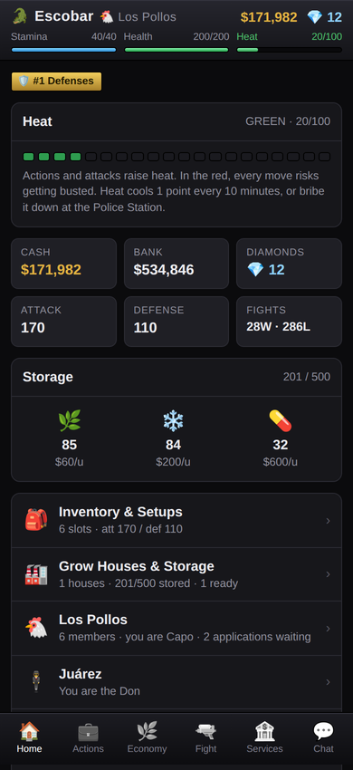
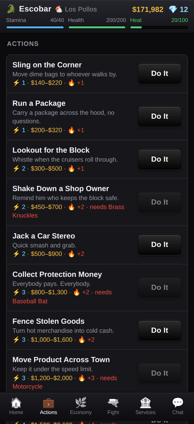
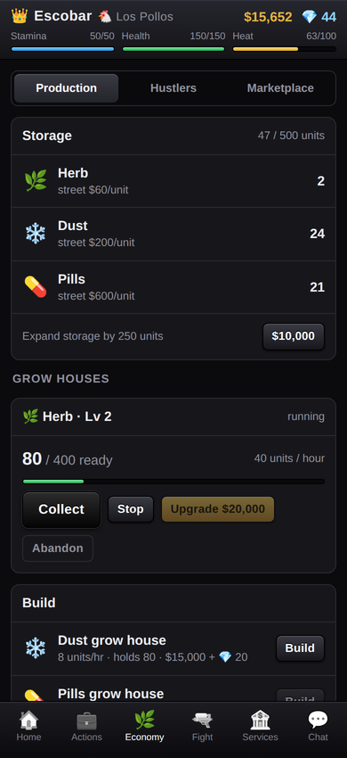
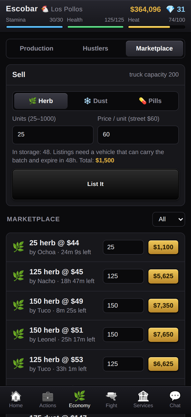
</p>
<p>
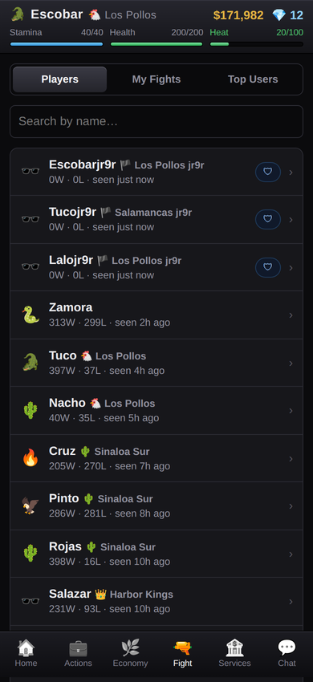
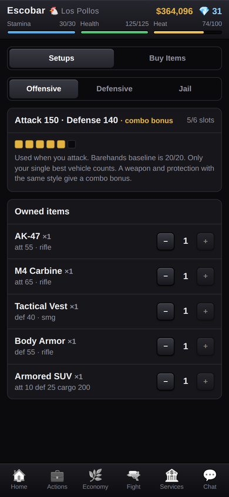
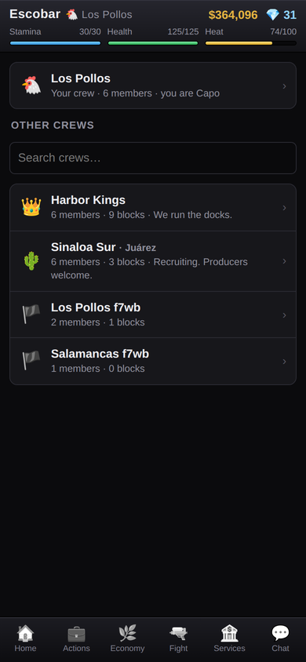
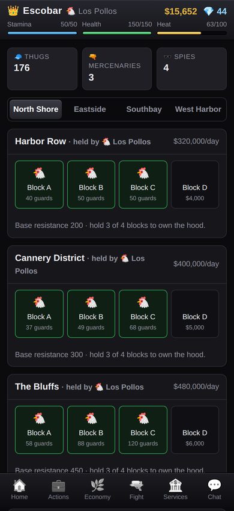
</p>
<p>
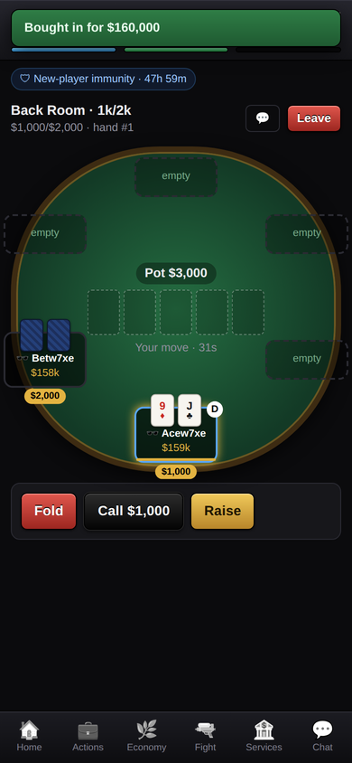
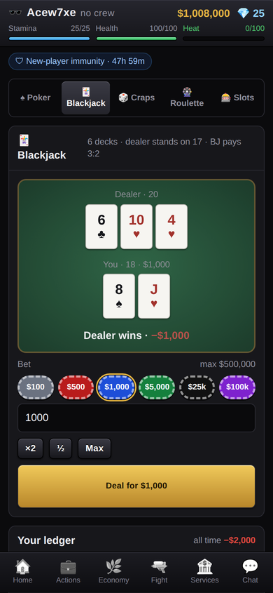
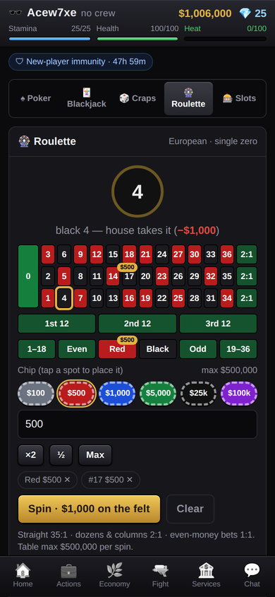
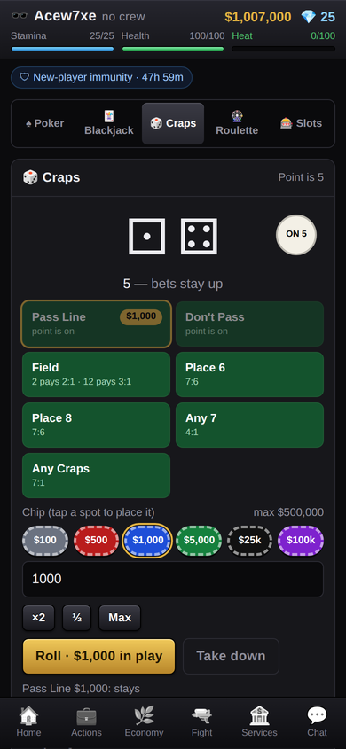
</p>

## Stack

- **Backend:** Supabase (Postgres + Auth + Realtime). All game logic is SQL in
  `supabase/migrations/` — every state change is a `security definer` RPC, and
  regen/production/payouts are computed lazily from timestamps. No cron, no
  edge functions.
- **Web:** Vite + React + TypeScript in `web/`, mobile-first, `@supabase/supabase-js`.

## Run it against a Supabase project

1. Create a project at supabase.com, then push the migrations:
   ```sh
   npx supabase login
   npx supabase link --project-ref <your-project-ref>
   npx supabase db push
   ```
   (or paste the files from `supabase/migrations/` into the SQL editor, in order).
2. In the Supabase dashboard → Authentication → Providers → Email, turn **off**
   "Confirm email" unless you've set up SMTP.
3. Configure and run the web app:
   ```sh
   cd web
   cp .env.example .env      # set VITE_SUPABASE_URL and VITE_SUPABASE_ANON_KEY
   npm install
   npm run dev
   ```
4. Deploy `web/` anywhere static. Pushing to `main` on GitHub deploys it to
   GitHub Pages automatically (`.github/workflows/pages.yml` — edit the two
   `VITE_SUPABASE_*` values there for your project). Vercel / Netlify /
   Cloudflare Pages also work; it's a single-page app, so route all paths to
   `index.html` (`web/vercel.json` and `web/public/_redirects` are included;
   `web/public/404.html` does the same job on GitHub Pages).

## Live vs staging

Two branches, one Pages site, one Supabase project:

| branch    | URL                                             | build flag           | what's on |
|-----------|-------------------------------------------------|----------------------|-----------|
| `main`    | `https://<user>.github.io/cartel-wars/`         | —                    | the live game, forum included; casino shows **slots only** |
| `staging` | `https://<user>.github.io/cartel-wars/staging/` | `VITE_STAGE=staging` | everything: full casino (poker, blackjack, craps, roulette) |

`web/src/lib/features.ts` is the switch. Both builds share the live database
(the free tier allows two active projects and both are taken), so a staging
migration lands on live data — keep staging-only features behind the flag and
promote them by merging `staging` into `main`. The Pages workflow builds both
branches on every push to either.

## Run it fully local (no Supabase account, no Docker)

Needs a local Postgres 15+ (`initdb`/`pg_ctl` on PATH) and Node 20+.

```sh
npm install                  # root: installs scripts/ deps
npm run db:reset             # starts a throwaway Postgres on :54329 and applies migrations
npm run dev:api              # tiny GoTrue+PostgREST stand-in on :54321 (see scripts/dev-server.mjs)
cd web && npm install && cp .env.local.example .env.local && npm run dev
```

Optional: populate a demo world (24 bots, three crews, a cartel, held blocks,
listings, chat) so the city looks alive, then sign in as `bot01@demo.local` /
`secret123`:

```sh
npm run db:demo
```

Tests:

```sh
npm run db:test              # SQL smoke tests of every RPC incl. casino, forum and the Sept 24 features (resets the local DB — re-run db:demo after)
npm run e2e                  # Playwright walkthroughs: core game, casino (two players at a table), forum
node scripts/tour.mjs out/   # screenshots of every screen as a demo bot
```

`npm run db:*` needs to run as a user that can start Postgres (on Linux:
`sudo -u postgres env PGDATA_DIR=/tmp/cartel-pg npm run db:reset`).

## Layout

```
supabase/migrations/20260921000001_schema.sql     tables, enums, RLS lockdown
supabase/migrations/20260921000002_functions.sql  all game rules (actions, fights, economy, crews, territory, chat)
supabase/migrations/20260921000003_seed.sql       content: commodities, items, actions, hoodlums, hoods/blocks
supabase/migrations/20260922000001_casino.sql     casino: slots, roulette, craps, blackjack, live hold'em tables
supabase/migrations/20260923000001_forum.sql      forum: boards, threads, replies, admins
supabase/migrations/20260924000001_remove_immunity.sql  removes new-player immunity
supabase/migrations/20260924000002_hospital.sql          +5 health / 5 min, buy health on a sliding scale, new tunables
supabase/migrations/20260924000003_crew_co_capo_ledger.sql  Co-Capo, crew/cartel bank ledger
supabase/migrations/20260924000004_producer_trader.sql   Producer / Trader paths at 100 rep
supabase/migrations/20260924000005_territory_grid.sql    9x9 hoods x 6 blocks, 50-win sieges, 51-thug minimum, block bonuses, attack logs
supabase/migrations/20260924000006_state.sql             get_me / get_catalog for the above
web/src/lib/api.ts                      typed wrappers for every RPC
web/src/lib/game.tsx                    session + player state (get_me) + toasts
web/src/pages/*                         Home, Actions, Economy, Fight, Player, Services, Items, Crew, Cartel, Territory, Chat, Profile, Casino, PokerTable, Forum
scripts/                                local Postgres harness, dev API server, smoke test, e2e
```

## Tuning

Game constants are in `_cfg()` (latest copy in `20260924000002_hospital.sql`); content tables
are in `20260921000003_seed.sql`. Change, re-run `npm run db:test`, then `supabase db push`
(new changes go in a new migration file once the project is live).

## Not yet built

Diamond purchases and the "Profession" stat. See SPEC.md for what's sourced
and what's a fill-in.

---

Unofficial fan reconstruction. Not affiliated with SMLSD, Webtouch SRL or Roasted Brains.
